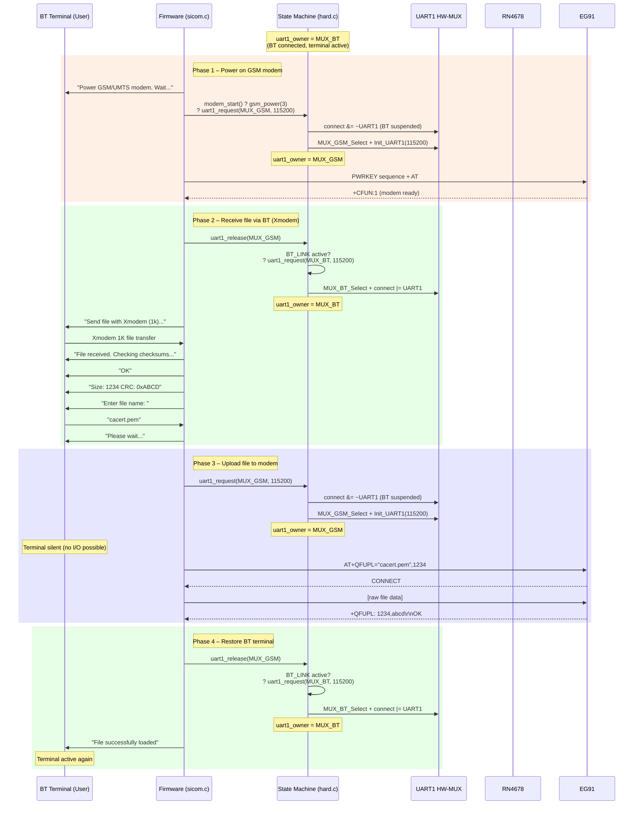

# Certificate Upload over Bluetooth – UART1 Sequence

## Overview

Certificate files (e.g. `cacert.pem`) are uploaded to the EG91 modem via BT terminal.  
UART1 is shared between BT (user terminal) and GSM (modem) using the state machine in `hard.c`.

## Sequence Diagram



## UART1 Owner Transitions

| Phase | Action | uart1_owner | MUX Pin | BT Terminal |
|-------|--------|-------------|---------|-------------|
| 1 | `modem_start()` ? `uart1_request(MUX_GSM, 115200)` | **GSM** | CSAF=1, CSBF=0 | suspended |
| 2 | `uart1_release(MUX_GSM)` ? auto-restore BT | **BT** | CSAF=0, CSBF=1 | active |
| 3 | `uart1_request(MUX_GSM, 115200)` | **GSM** | CSAF=1, CSBF=0 | suspended |
| 4 | `uart1_release(MUX_GSM)` ? auto-restore BT | **BT** | CSAF=0, CSBF=1 | active |

## Code Location (sicom.c, lines 414–458)

```c
putln(T_gsmpower);                          // "Power GSM/UMTS modem. Wait..."
if (modem_start() > 0)                      // Phase 1: GSM on (uart1_owner ? GSM)
{
  uart1_release(MUX_GSM);                   // Phase 2: BT back for terminal I/O
  clear_comchange();
  putln(T_fsend);                           // "Send file with Xmodem (1k)..."
  delete_data();

  if ((blno = xmodem_receive(...)) < 0)     // Xmodem receive via BT
    puterror(blno, -1);
  else
  {
    // ... CRC check, file info display ...

    putstr(T_fname);
    readline(fname, sizeof(fname), 'a');    // User enters filename via BT
    putln(T_wait);                          // "Please wait..." (last msg before silence)
    uart1_request(MUX_GSM, 115200);         // Phase 3: Switch to GSM
    fehler = file_to_uc15(filesize, fname); // Upload to modem
    uart1_release(MUX_GSM);                 // Phase 4: BT restored
    if (fehler > 0)
      putln(T_csucc);                       // "File successfully loaded" (visible!)
    else
      puterror(GSM_ERROR, -1);              // Error (also visible on BT)
  }
}
```

## Key Design Decisions

1. **"Please wait..." before suspend** – User sees feedback before terminal goes silent
2. **Result output after release** – `putln(T_csucc)` is placed *after* `uart1_release` so the BT user actually sees it
3. **`fehler` variable (int)** – Captures `file_to_uc15` return value while GSM owns UART1, reports after BT restore
4. **Auto-restore** – `uart1_release(MUX_GSM)` automatically calls `uart1_request(MUX_BT, 115200)` when `BT_LINK` is active

## Error Paths

| Condition | Output | UART1 after |
|-----------|--------|-------------|
| Modem doesn't start | "Fehler GSM/GPRS" | stays BT (never switched) |
| Xmodem timeout/error | error code | stays BT (Phase 2) |
| CRC mismatch | "CRC Error" | stays BT (Phase 2) |
| `file_to_uc15` fails | "Fehler GSM/GPRS" | BT (Phase 4 release) |
| Upload success | "File successfully loaded" | BT (Phase 4 release) |

---

## Change Log

### Fix 1: sicom.c – Certificate Upload State Machine (lines 449–456)

**Problem:**  
- Bare `MUX_GSM_Select;` macro bypassed the UART1 state machine  
- No `uart1_release` after `file_to_uc15` ? BT terminal permanently dead  
- `putln(T_csucc)` was between request/release ? output went to GSM, not BT  
- Used `uchar i` for `file_to_uc15` result (returns `int`, negative values wrap)  
- User got "ÿ" (0xFF) character = garbage from unconfigured UART1 RX  

**Before:**
```c
readline(fname, sizeof(fname), 'a');
MUX_GSM_Select;                             // bare macro, no state machine!
if (file_to_uc15(filesize, fname) > 0)      // result visible only to GSM...
  putln(T_csucc);                           // ...user never sees this
// NO uart1_release ? BT dead forever
```

**After:**
```c
readline(fname, sizeof(fname), 'a');
putln(T_wait);                              // "Please wait..." before silence
uart1_request(MUX_GSM, 115200);             // proper state machine switch
fehler = file_to_uc15(filesize, fname);     // int variable captures result
uart1_release(MUX_GSM);                     // auto-restores BT
if (fehler > 0)
  putln(T_csucc);                           // visible on BT terminal!
else
  puterror(GSM_ERROR, -1);                  // error also visible
```

**Changes:**
1. Added `putln(T_wait)` – user feedback before terminal goes silent
2. Replaced `MUX_GSM_Select` with `uart1_request(MUX_GSM, 115200)`
3. Added `uart1_release(MUX_GSM)` after upload completes
4. Moved result output *after* release so BT user sees it
5. Used `fehler` (int) instead of `i` (uchar) for proper return value handling
6. Added error path with `puterror(GSM_ERROR, -1)`

---

### Fix 2: btio.c – RN4678 Second Reboot (lines 207–214)

**Problem:**  
- `putstr(T_sr1)` sends via `putb()` which checks `connect & UART1`  
- During BT init, `BT_LINK` is not yet set ? `connect & UART1 = 0`  
- **Reboot command "R,1\r" never reached the module!**  
- Module stayed in command mode, 5s dot-loop timed out (all 5 dots printed)  
- Subsequent `$$$` was invalid (already in command mode) ? `ERR1`  

**Before:**
```c
putstr(T_sr1);                              // BROKEN: putb() won't send (connect&UART1=0)
Init_BT_ch(115200);
{ uchar wt; bxi=rxi;
  for (wt=0; wt<5; wt++)                   // 5s wait for data
  { osDelay(1000); ResetWDT(); putc('.');
    if (bxi!=rxi) break;                   // never breaks (no reboot happened)
  } newline(); }
osDelay(500);
bxi=rxi;
result=bt_command(T_$, T_cmdp, 10300);     // $$$?ERR1 (already in CMD mode)
```

**After:**
```c
result=bt_command(T_sr1, T_reb, 10500);    // bt_command writes directly to UART1!
Init_BT_ch(115200);
putc('.'); osDelay(1000); ResetWDT();       // 2s wait with visible dots
putc('.'); osDelay(1000); ResetWDT();
newline();
bxi=rxi;                                   // flush RX before $$$
result=bt_command(T_$, T_cmdp, 10300);     // now works: module rebooted properly
```

**Changes:**
1. Replaced `putstr(T_sr1)` with `bt_command(T_sr1, T_reb, 10500)` – sends directly via UART1 TX register, waits for "Reboot" ack
2. Replaced 5s conditional wait loop with fixed 2s wait (module needs ~1-2s to boot after `SO,,` disabled status messages)
3. Kept dot feedback for user visibility
4. `bxi=rxi` flushes any residual boot output before sending `$$$`

---

### Summary of Root Causes

| Symptom | Root Cause | File | Fix |
|---------|-----------|------|-----|
| "ÿ" after filename entry | Bare `MUX_GSM_Select` without UART1 init | sicom.c:449 | `uart1_request()` |
| BT terminal dead after cert upload | Missing `uart1_release` | sicom.c | Added release after `file_to_uc15` |
| Success message invisible on BT | `putln` while GSM owns UART1 | sicom.c:451 | Moved after `uart1_release` |
| "Fehler Bluetooth" on init | `putstr(T_sr1)` doesn't reach module | btio.c:207 | `bt_command(T_sr1,...)` |
| 5 dots + ERR1 | No actual reboot ? `$$$` in CMD mode | btio.c:211 | Proper reboot + 2s wait |
