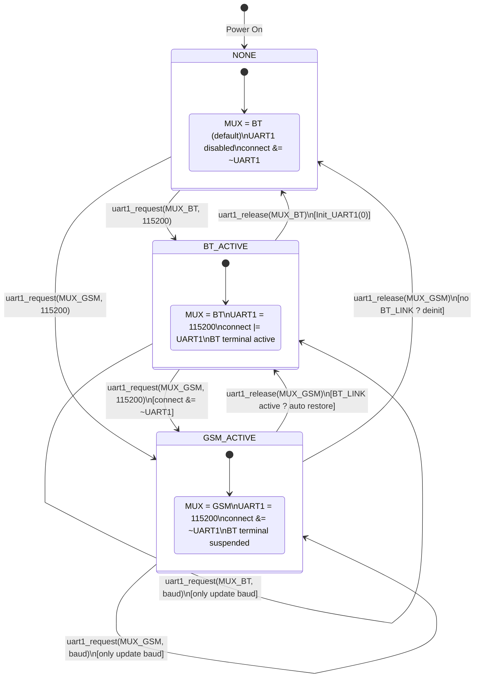

# UART1 Resource Owner State Machine

## State Diagram



## Request/Release Flowchart

```mermaid
flowchart TD
    subgraph uart1_request["uart1_request(requester, baud)"]
        R1{requester == uart1_owner?}
        R1 -->|Yes| R2[Init_UART1 baud only]
        R2 --> R_OK[return TRUE]

        R1 -->|No| R3{uart1_owner == MUX_BT?}
        R3 -->|Yes| R4["connect &= ~UART1\n(suspend BT output)"]
        R3 -->|No| R5[MUX switch]

        R4 --> R5
        R5 --> R6{requester?}
        R6 -->|MUX_BT| R7[MUX_BT_Select]
        R6 -->|MUX_GSM| R8[MUX_GSM_Select]

        R7 --> R9[Init_UART1 baud]
        R8 --> R9

        R9 --> R10[uart1_owner = requester]
        R10 --> R11{requester==MUX_BT AND BT_LINK?}
        R11 -->|Yes| R12["connect |= UART1"]
        R11 -->|No| R_OK
        R12 --> R_OK
    end

    subgraph uart1_release["uart1_release(requester)"]
        L1{requester == uart1_owner?}
        L1 -->|No| L_DONE[return - not owner]
        L1 -->|Yes| L2{connect & BT_LINK?}
        L2 -->|Yes| L3["uart1_request(MUX_BT, 115200)\n? auto-restore BT"]
        L2 -->|No| L4[Init_UART1 0]
        L4 --> L5[MUX_BT_Select]
        L5 --> L6[uart1_owner = MUX_NONE]
        L3 --> L_DONE2[return]
        L6 --> L_DONE2
    end
```



## API

| Function | Purpose |
|----------|---------|
| `uart1_request(requester, baud)` | Request UART1 ownership. Suspends BT output if switching away from BT. Returns TRUE if granted. |
| `uart1_release(requester)` | Release UART1. Auto-restores BT if `BT_LINK` is still active, otherwise deinits UART1. |

## States

| State | uart1_owner | MUX | UART1 | connect & UART1 |
|-------|-------------|-----|-------|-----------------|
| NONE | MUX_NONE | BT (idle default) | disabled | 0 |
| BT_ACTIVE | MUX_BT | BT | 115200 | 1 (if BT_LINK) |
| GSM_ACTIVE | MUX_GSM | GSM | 115200 | 0 (BT suspended) |

## Key Behavior

- **BT?GSM transition**: `connect &= ~UART1` prevents `putb()` from hanging on wrong CTS
- **GSM?BT restore**: `uart1_release(MUX_GSM)` detects `BT_LINK` and auto-calls `uart1_request(MUX_BT, 115200)`
- **Same-owner request**: Only updates baud rate, no MUX switching
- **Non-owner release**: Ignored (safety guard)

## Files

- Declaration: `hard.h` (enum + extern + prototypes)
- Implementation: `hard.c` (after `Init_UART1()`)

## Changes (2026-05-04)

### New: State Machine (`hard.h` / `hard.c`)

```c
// hard.h
enum { MUX_NONE=0, MUX_BT, MUX_GSM, MUX_GPS };
extern uchar uart1_owner;
extern uchar uart1_request (uchar requester, uint baud);
extern void  uart1_release (uchar requester);
```

Implementation in `hard.c` after `Init_UART1()`:
- `uart1_request()`: Claims UART1, suspends BT if switching away, uses `__disable_irq()`/`__enable_irq()` for thread safety
- `uart1_release()`: Releases UART1, auto-restores BT only on non-BT release (`requester != MUX_BT`)

### Refactored Wrappers

| File | Function | Change |
|------|----------|--------|
| `btio.c` | `Init_BT_ch()` | Now calls `uart1_request(MUX_BT, baud)` + CTS check |
| `gsmio.c` | `Init_GSM_ch()` | Now calls `uart1_request(MUX_GSM, baud)` |

### Refactored Call Sites

| File | Location | Before | After |
|------|----------|--------|-------|
| `gsmio.c` | `gsm_power(0)` | `if(BT_LINK) Init_BT_ch else Init_UART1(0)+MUX_BT` | `uart1_release(MUX_GSM)` |
| `gsmio.c` | `init_gsm()` guard | `connect&UART1` | `connect&GSM_LINK` |
| `gsmio.c` | `init_gsm()` end | `Init_UART1(0)` | `uart1_release(MUX_GSM)` |
| `sicom.c` | upload_file after `modem_start` | `MUX_BT_Select` | `uart1_release(MUX_GSM)` |
| `mqtt.c` | MQTT error handler | `Init_UART1(0); MUX_BT_Select` | `uart1_release(MUX_GSM)` |
| `libtool.c` | debug terminal end | `Init_UART1(0); MUX_BT_Select` | `uart1_release(uart1_owner)` |
| `btio.c` | 5x end of BT functions | `Init_UART1(0)` | `uart1_release(MUX_BT)` |
| `measure.c` | BT timeout disconnect | `Init_UART1(0)` | `uart1_release(MUX_BT)` |

### Bug Fixes Found During Code Review

| Bug | Cause | Fix |
|-----|-------|-----|
| `uart1_release(MUX_BT)` infinite loop on BT disconnect | Auto-restore checked `BT_LINK` even on self-release | Guard: `requester != MUX_BT` before auto-restore |
| `libtool.c` debug terminal: wrong owner | Hardcoded `MUX_GSM` but could be BT | Use `uart1_release(uart1_owner)` |
| Race condition MQTT thread vs main thread | `uart1_owner` + `connect` not atomic | `__disable_irq()`/`__enable_irq()` around critical sections |

### RN4678 Reboot Timing Fix (`btio.c`)

**Problem:** After final `R,1` (reboot) during BT configuration, code sent `$$$` too early.
Module not ready ? no `CMD>` ? "Fehler Bluetooth".

**Fix:** Replaced blind `osDelay(1000)` with visible wait loop:
```c
{ uchar wt; bxi=rxi;                // Flush RX buffer
  for (wt=0; wt<5; wt++)            // Wait up to 5s
  { osDelay(1000); ResetWDT(); putc('.');  // Print dot each second
    if (bxi!=rxi) break;            // Data received -> module alive
  } newline(); }
```
Terminal output: `R,1.....` (each dot = 1s wait, breaks early on module response).

### Unchanged (correct as-is)

- `main.c:138/207` – `Init_GSM_ch`/`Init_BT_ch` use state machine via wrapper
- `main.c:169` – bare `MUX_BT_Select` after test_gps: `gsm_power(0)` follows
- `btio.c:41` – `MUX_BT_Select` in `bt_command()`: safety GPIO, owner already MUX_BT
- `gsmio.c:206-208` – baud rate probing: same owner, only rate change
- `libtool.c:1037` – `Init_BT_ch(baud)` in `communication_change()`: uses state machine
- `connect=UART1` in gsmio.c/mqtt.c: intentional exclusive mode within GSM session
- `connect|=(UART1|BT_LINK)` in libtool.c:1040: necessary for first-time BT connect

### Test Plan

1. Flash firmware
2. Connect via BT terminal
3. Verify menu text displays correctly (no garbled characters)
4. Activate GSM/LTE via config menu over BT ? should work (guard changed to `GSM_LINK`)
5. After GSM init, BT terminal should auto-restore
6. Deactivate GSM over BT ? BT stays alive
7. BT timeout (6 min no input) ? clean disconnect
8. RS232 terminal should work at all times independently
9. `init_bluetooth()` over RS232 ? RN4678 config completes (dots visible during reboot wait)
